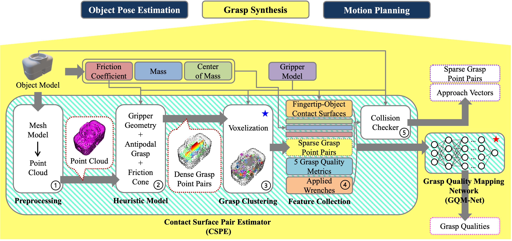

# CPPE

Contact point pair estimator (CPPE) for 6DOF grasp detection. The framework takes a complete object point cloud file to generate possible contact point pairs and their robustness (a.k.a grasp dictionaries) for a parallel jaw gripper using both analytical and data-driven models.

## Table of Contents

- [Repository Structure](#repository-structure)
- [Download Process](#download-process)
- [How to Run](#how-to-run)
    - [CPPE_v2](#cppe_v2)
    - [Extra Processing](#extra-processing)
    - [Quality Estimation (ML)](#quality-estimation)
- [ToDo Lists](#todo-lists)

---

## Repository Structure

    ├── ML_modules        # DL modules 
    │   ├── engine.py
    │   ├── eval.py
    │   ├── model.py      
    │   ├── train.py     
    │   ├── transforms.py 
    │   └── utils.py    
    ├── dataset
    |   └── train         # ML training data
    ├── images              
    ├── objects
    │   ├── dicts         # .txt grasp files
    │   └── pcds          # .pcd files
    ├── CPPE_utils.py     
    ├── CPPE_v2.py        
    ├── gripper_config.py 
    ├── helper.py 
    └── quality.py        

## Download Process

    git clone https://github.com/kidpaul94/CPPE.git
    cd CPPE/
    pip3 install -r requirements.txt

## How to Run

### CPPE_v2:

> **Note**
`CPPE_v2.py` receives several different arguments. Run the `--help` command to see everything it receives.

    python3 CPPE_v2.py --help

### Extra Processing:

> **Note**
`helper.py` receives several different arguments to convert a CAD model to a point cloud or visualize grasp configurations. Run the `--help` command to see everything it receives.

    python3 helper.py --help

### Quality Estimation:

> **Note**
`traib.py` receives several different arguments. Run the `--help` command to see everything it receives.

    cd ML_modules/
    python3 train.py --help

## ToDo Lists

| **Work on ML pipeline** |  |
| --- | --- |
